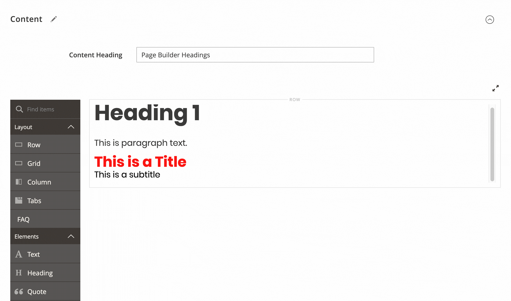

# PageBuilderExtensionText

Under the hood, the Page Builder Text content type uses the [TinyMCE WYSIWYG HTML Editor](https://www.tiny.cloud/docs-4x/). In this example, we show you how to:

* Add and remove buttons from the [TinyMCE toolbar](https://www.tiny.cloud/docs/advanced/editor-control-identifiers/#toolbarcontrols) 
* Integrate your theme's typography into the [TinyMCE Formats selector](https://www.tiny.cloud/docs/configure/content-formatting/#formattype)
* Add the [TinyMCE code plugin](https://www.tiny.cloud/docs/plugins/code/) (< >) to the toolbar so you can view the HTML code directly.

_Text content type showing theme styles_

## Installation and usage

To install this extension module:

1. Copy the `PageBuilderExtensionText` directory and all its contents into a new (or your existing) `Example` vendor directory: `<magento-root>/app/code/Example`.
2. Command line into your `<magento-root>` directory and run `bin/magento setup:upgrade` to install the extension.
3. Navigate to a Page Builder instance, drag a Text content type onto the Admin stage, and click the **Formats** selector in the toolbar to see your theme styles displayed.
4. Enter some text, then click the `code` button (< >) in the toolbar to view the HTML.

## Feedback

We encourage and welcome you to help us keep these examples current by submitting pull requests and issues. 
We also welcome your feedback and ideas on other code examples you would like to see added to this repo. 

## Slack
You can join our [#pagebuilder channel](https://magentocommeng.slack.com/messages/CHB455HPF), within [magentocommeng.slack.com](https://magentocommeng.slack.com/), to post your questions to the Page Builder community.
